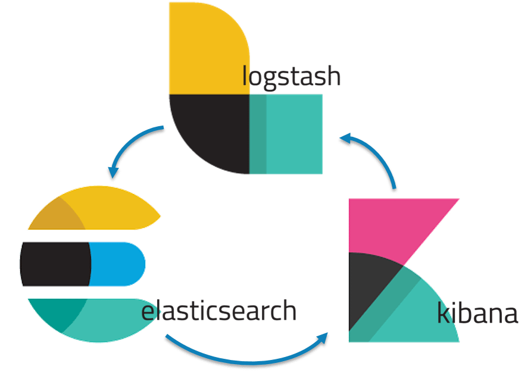
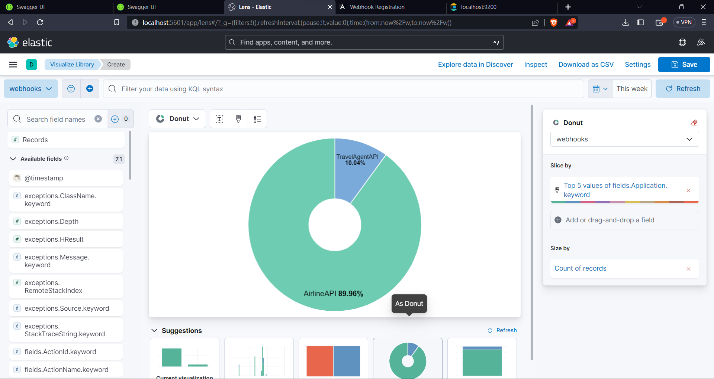
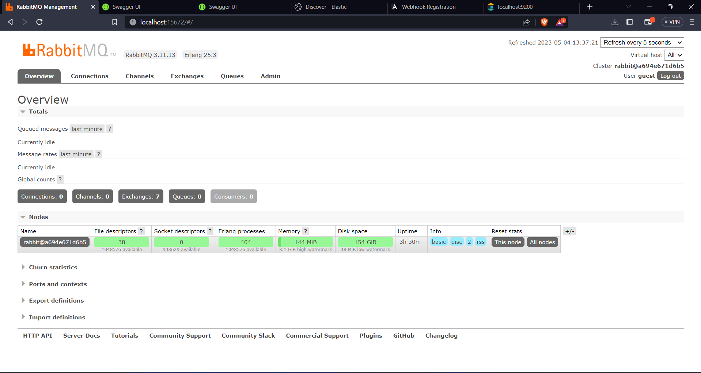
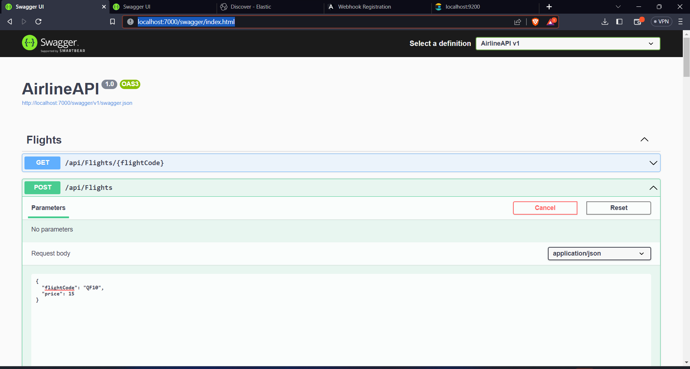
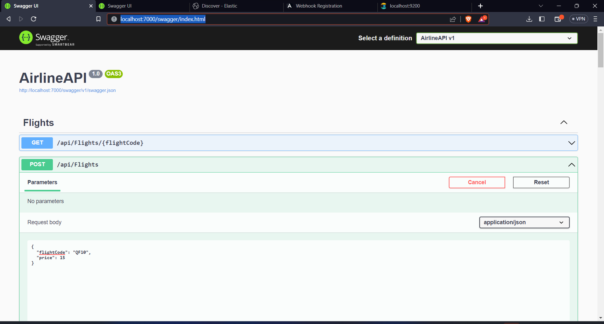
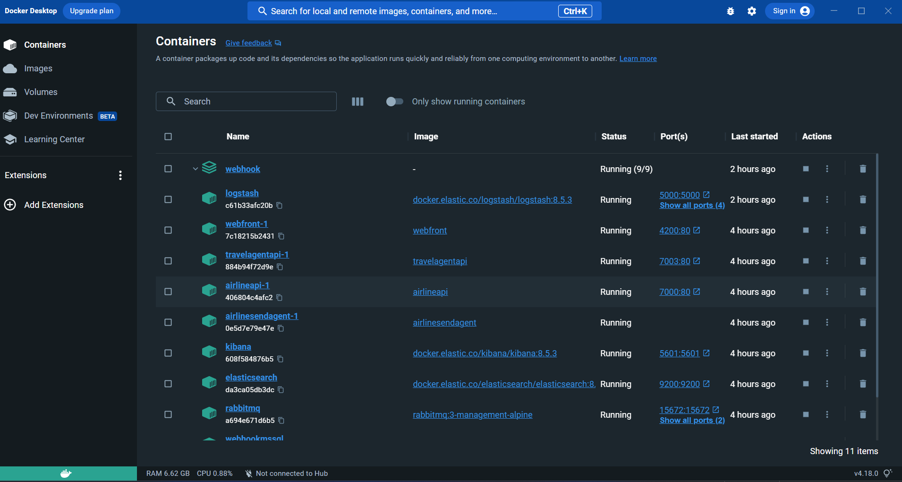
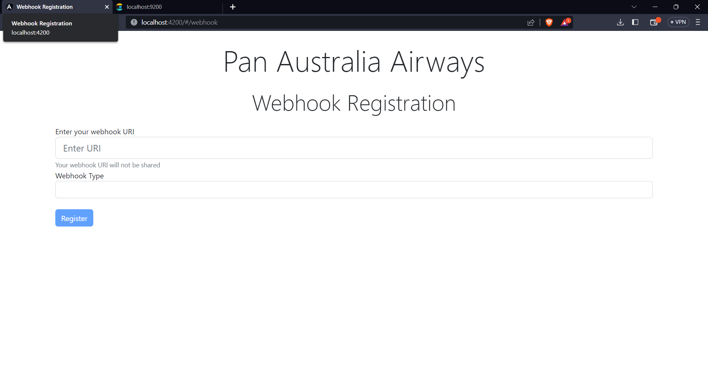

# C# .Net Core Webhook Practice
## Summary
Webhooks are a way for web applications to automatically notify other applications when a certain event occurs. This allows for powerful integration between different applications and automation of tasks that would otherwise require manual intervention.

When the wehbook is setup the application sends the notication ("The Sender") in form of a HTTP request to a subscribed url; another application ("The receiver"). The reciever then process the request and performs any necessary actions based on the data included in the request.

## Architecture

## High Level Architecture


### System Requirements

* **Minimum of 4GB RAM** System
* CPU Cores: Minimum of 2

## Features

* Register Webhook Endpoint
* Delete Webhook Subscription
* Get Webhook Subscription
* Price Change Event Trigger
* Add Price Endpoint
* Send Webhook Payload to Specified Uri

## Technologies Used

The technologies used for building the application includes the following

* [Frontend - Angular](https://angular.io/cli)
* Database - MSSQL, running on Docker - See docker-compose and docker-compose.override yml files
* Logging, Monitoring and Observalibility - ElasticSearch, Kibana and Logstash - Also in docker-compose and docker-compose.overide yml files
* Backend - API's, Worker Service: .NET 6, C#
* [RabbitMQ](https://www.rabbitmq.com/) - For messaging

### Installations
### Docker

Download and install docker from [https://www.docker.com/products/docker-desktop](https://www.docker.com/products/docker-desktop) to run the application

### Manual

The following tools are required:

* [node - npm](https://nodejs.org/) to run angular application
* [Angular](https://angular.io/cli)
* [.NET 6 or >](https://dotnet.microsoft.com/en-us/download/dotnet/6.0)
* [Docker](https://www.docker.com/products/docker-desktop)
* [Visual Studio](https://visualstudio.microsoft.com/vs/) or [Visual Studio Code](https://code.visualstudio.com/)
* [Postman]() - not necessary as api's are configured to show swagger, but can still be used based on personl preference.

## Project Setup

1. Clone the repository
2. Open the root folder of the project in a terminal
3. Run the following commands to run all applications as docker containers

```js
docker-compose -f docker-compose.yml -f docker-compose-override.yml up -d
```

4. Open the following URL's in your browser

 

* **Elk Stack => Kibana URL-> [http://localhost:5601](http://localhost:5601) ,Elastic URL [http://localhost:9200](http://localhost:5601) and Logstash URL [http://localhost:9600](http://localhost:9600)**


* ** RabbitMQ -> [http://localhost:15672](http://localhost:15672) **username** and **password** = **"guest"**


* **AirlineAPI URL -> [http://localhost:7000/swagger](http://localhost:7000/swagger)**


* **TravelAgentAPI URL -> [http://localhost:7003/swagger](http://localhost:7003/swagger)**


* **Docker container** 


* **Frontend URL -> [http://localhost:4200](http://localhost:4200)**

## Author

- Stanley-Kemuel Salvation, Lloyd - [@skemuel007](https://www.github.com/skemuel007) - Software Engineer
